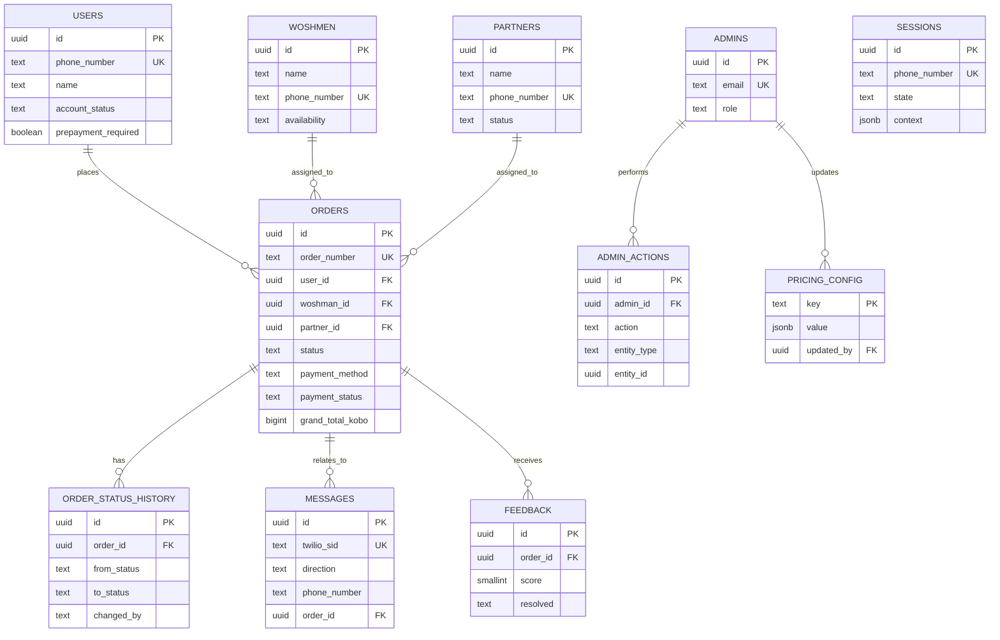

# Woshmart — Database Schema

PostgreSQL. This is the source of truth for `prisma/schema.prisma` — if they ever diverge, this document wins and the Prisma schema needs updating, not the other way around.

## Entity relationship diagram

`SESSIONS` and `PRICING_CONFIG` aren't wired into the relationship diagram above beyond their FK to `ADMINS` (pricing_config) because they're not directly relational to the order graph — `sessions` is keyed independently by `phone_number` and is conversation-scoped, not order-scoped.

## Tables

### `users`
Customer records. `phone_number` is the primary lookup key on every inbound message.

| Column | Type | Notes |
|---|---|---|
| id | UUID PK | |
| phone_number | TEXT UNIQUE NOT NULL | E.164 format |
| name | TEXT | |
| first_order_at | TIMESTAMPTZ | |
| last_order_at | TIMESTAMPTZ | |
| total_orders | INTEGER DEFAULT 0 | |
| total_spend_kobo | BIGINT DEFAULT 0 | |
| referral_source | TEXT | |
| account_status | TEXT DEFAULT 'active' | `active` / `flagged` / `blocked` |
| prepayment_required | BOOLEAN DEFAULT false | |
| notes | TEXT | |
| created_at / updated_at | TIMESTAMPTZ | |

Index: `phone_number`.

### `sessions`
Conversation state — one active row per phone number. Not order-scoped; this is the FSM's working memory.

| Column | Type | Notes |
|---|---|---|
| id | UUID PK | |
| phone_number | TEXT UNIQUE NOT NULL | |
| state | TEXT NOT NULL | Current FSM stage |
| context | JSONB DEFAULT '{}' | In-progress order draft / selections |
| last_message_at | TIMESTAMPTZ | |
| expires_at | TIMESTAMPTZ | Keyed by timeout jobs |
| created_at / updated_at | TIMESTAMPTZ | |

Indexes: `phone_number`; partial index on `expires_at WHERE expires_at IS NOT NULL`.

### `woshmen`

| Column | Type | Notes |
|---|---|---|
| id | UUID PK | |
| name | TEXT NOT NULL | |
| phone_number | TEXT UNIQUE NOT NULL | |
| availability | TEXT DEFAULT 'available' | `available` / `on_job` / `off_duty` |
| jobs_today | INTEGER DEFAULT 0 | |
| jobs_this_month | INTEGER DEFAULT 0 | |
| piece_rate_earnings_kobo | BIGINT DEFAULT 0 | |
| retainer_paid_this_month | BOOLEAN DEFAULT false | |
| complaints_this_month | INTEGER DEFAULT 0 | |
| missing_items_this_month | INTEGER DEFAULT 0 | |
| active | BOOLEAN DEFAULT true | |
| joined_at | TIMESTAMPTZ | |

### `partners`

| Column | Type | Notes |
|---|---|---|
| id | UUID PK | |
| name | TEXT NOT NULL | |
| address | TEXT | |
| contact_name | TEXT | |
| phone_number | TEXT UNIQUE NOT NULL | |
| capacity_per_day | INTEGER | |
| can_do_starch | BOOLEAN DEFAULT false | |
| can_do_express | BOOLEAN DEFAULT false | |
| last_rating | NUMERIC(2,1) | |
| status | TEXT DEFAULT 'active' | `active` / `warning` / `suspended` |
| outstanding_balance_kobo | BIGINT DEFAULT 0 | |

### `orders`
The core entity. Status enum matches the 14-state lifecycle in `PRD.md` §9.

| Column | Type | Notes |
|---|---|---|
| id | UUID PK | |
| order_number | TEXT UNIQUE NOT NULL | Human-facing, e.g. `WM-001` |
| user_id | UUID FK → users | |
| address | TEXT NOT NULL | |
| landmark | TEXT | |
| zone | TEXT NOT NULL | |
| service_type | TEXT NOT NULL | `starter` / `weekly` / `family` / `household` / `per_item` |
| items_description | TEXT | |
| service_total_kobo | BIGINT NOT NULL | |
| small_basket_fee_kobo | BIGINT DEFAULT 0 | |
| logistics_fee_kobo | BIGINT DEFAULT 0 | |
| grand_total_kobo | BIGINT NOT NULL | |
| amount_paid_kobo | BIGINT DEFAULT 0 | |
| payment_method | TEXT NOT NULL | `transfer` / `cod` |
| payment_status | TEXT DEFAULT 'pending' | `pending` / `confirmed` / `refunded` |
| pickup_date | DATE | |
| pickup_window | TEXT | |
| woshman_id | UUID FK → woshmen | nullable |
| partner_id | UUID FK → partners | nullable |
| status | TEXT DEFAULT 'initiated' | 14-value enum, see below |
| delivered_at | TIMESTAMPTZ | |
| notes | TEXT | |
| created_at / updated_at | TIMESTAMPTZ | |

`status` CHECK constraint values: `initiated`, `awaiting_confirmation`, `awaiting_payment`, `paid`, `assigned`, `pickup_scheduled`, `picked_up`, `at_laundry`, `ready_for_delivery`, `out_for_delivery`, `delivered`, `closed`, `cancelled`, `abandoned`, `disputed`.

Indexes: `user_id`, `status`, `woshman_id`, `created_at`, composite `(status, created_at)`.

**Never write `orders.status` directly outside the state machine function — see `TRD.md` §9 for the legal-transition table.**

### `order_status_history`
Audit trail — don't rely on `orders.updated_at` alone for "when did this change."

| Column | Type | Notes |
|---|---|---|
| id | UUID PK | |
| order_id | UUID FK → orders | |
| from_status | TEXT | nullable (first transition) |
| to_status | TEXT NOT NULL | |
| changed_by | TEXT NOT NULL | `system` / `admin:<id>` / `woshman` / `partner` |
| note | TEXT | |
| created_at | TIMESTAMPTZ | |

Index: `order_id`.

### `messages`
Every inbound and outbound WhatsApp message.

| Column | Type | Notes |
|---|---|---|
| id | UUID PK | |
| twilio_sid | TEXT UNIQUE | Idempotency key |
| direction | TEXT NOT NULL | `inbound` / `outbound` |
| phone_number | TEXT NOT NULL | |
| order_id | UUID FK → orders | nullable |
| body | TEXT | |
| status | TEXT | `queued` / `sent` / `delivered` / `read` / `failed` |
| raw_payload | JSONB | Full Twilio payload, for debugging |
| created_at | TIMESTAMPTZ | |

Indexes: `phone_number`, `order_id`, `twilio_sid`.

### `feedback`

| Column | Type | Notes |
|---|---|---|
| id | UUID PK | |
| order_id | UUID FK → orders NOT NULL | |
| score | SMALLINT NOT NULL | 1–3, per `PRD.md` §10 feedback prompt |
| text | TEXT | Free text |
| resolved | TEXT DEFAULT 'n/a' | `yes` / `no` / `n/a` |
| coo_notes | TEXT | |
| created_at | TIMESTAMPTZ | |

### `admins`
Retool-facing users.

| Column | Type | Notes |
|---|---|---|
| id | UUID PK | |
| email | TEXT UNIQUE NOT NULL | |
| password_hash | TEXT NOT NULL | bcrypt/argon2id — never plaintext |
| name | TEXT NOT NULL | |
| role | TEXT DEFAULT 'ops' | `super_admin` / `ops` / `viewer` |
| active | BOOLEAN DEFAULT true | |
| last_login_at | TIMESTAMPTZ | |
| created_at | TIMESTAMPTZ | |

### `admin_actions`
Audit log for every Admin API write. Populated automatically by middleware — never opt-in per route.

| Column | Type | Notes |
|---|---|---|
| id | UUID PK | |
| admin_id | UUID FK → admins NOT NULL | |
| action | TEXT NOT NULL | e.g. `order.status.update` |
| entity_type | TEXT NOT NULL | |
| entity_id | UUID | |
| before_value | JSONB | |
| after_value | JSONB | |
| ip_address | TEXT | |
| created_at | TIMESTAMPTZ | |

### `pricing_config`
Editable-without-deploy pricing values (wired up in Phase 9+ per `BUILD_SCRIPT.md` — schema exists from day one, editability via Retool comes later).

| Column | Type | Notes |
|---|---|---|
| key | TEXT PK | e.g. `bundle.starter.price_kobo` |
| value | JSONB NOT NULL | |
| updated_by | UUID FK → admins | |
| updated_at | TIMESTAMPTZ | |

## Rules that apply across the whole schema

- **Money is always `BIGINT` kobo.** Never `NUMERIC`/`float` for any currency column, anywhere.
- **Phone numbers are always E.164**, normalized on ingestion — this is what prevents duplicate `users`/`woshmen`/`partners` rows for the same person.
- **`orders.status` has exactly one writer** — the state machine function in `order.statemachine.ts` (`TRD.md` §9). No table, migration script, or endpoint bypasses it.
- **Every write to `admins`-authenticated resources produces an `admin_actions` row.** An audit log with gaps is worse than none — it creates false confidence.
