# Woshmart — Implementation Plan

This is the roadmap view — dependencies, milestones, risk, and what's deliberately deferred. For the task-by-task execution detail with ready-to-use prompts, see `BUILD_SCRIPT.md`. For progress tracking, see `BUILD_LOG.md`.

## 1. Phase dependency graph

```mermaid
flowchart LR
    P0[Phase 0<br/>Pre-work & scaffolding] --> P1[Phase 1<br/>Foundation]
    P1 --> P2[Phase 2<br/>Conversation engine core]
    P2 --> P3[Phase 3<br/>Full conversation flow]
    P3 --> P4[Phase 4<br/>Woshmen/partners/keywords]
    P4 --> P5[Phase 5<br/>Admin API + Retool]
    P5 --> P6[Phase 6<br/>Timeouts & resilience]
    P6 --> P7[Phase 7<br/>Security hardening]
    P7 --> P8[Phase 8<br/>Launch readiness]
    P8 --> P9[Phase 9+<br/>Post-MVP, ad hoc]
```

Every phase is a hard dependency on the one before it — there's no meaningful parallelization opportunity between phases within the backend build, because each one builds directly on primitives the last one established (webhook validation → session state → conversation logic → order mutation → admin control surface → resilience → hardening → launch). The one genuinely parallel track is **Phase 0's human/ops setup** (Twilio, Meta Business Profile) running alongside early engineering work — see §3.

## 2. Milestones

| Milestone | Corresponds to | What it proves |
|---|---|---|
| **M1 — Pipe is secure** | End of Phase 1 | A real WhatsApp message is received, verified, and logged correctly. Nothing unsigned gets through. |
| **M2 — One conversation works** | End of Phase 2 | The full inbound → FSM → outbound loop works for a real (if minimal) conversation. |
| **M3 — An order can be placed** | End of Phase 3 | A customer can go from "hi" to a real order sitting in the database via WhatsApp alone. |
| **M4 — An order can be fulfilled** | End of Phase 4 | The operational side (Woshman/partner keyword protocol) can carry an order from paid to delivered without COO manually messaging anyone. |
| **M5 — Ops can run the business** | End of Phase 5 | The COO can do their entire job — verify payment, assign, monitor, intervene — from Retool alone. |
| **M6 — System is self-healing** | End of Phase 6 | Crashes, retries, and timeouts don't lose or duplicate state. |
| **M7 — System is production-safe** | End of Phase 7 | Security/reliability posture has been deliberately audited, not just assumed. |
| **M8 — Staging verified, production configured** | End of Phase 8 | Everything is ready to receive real traffic, but nothing unsupervised has happened yet. |
| **M8a — Supervised pilot passed** | End of Phase 8a | A handful of real orders ran on production with a human watching live — the actual proof that reviewed code behaves correctly with real people, not just in tests. |
| **M9 — Launch** | After Phase 8a | System is open to unsupervised customer traffic. |

Do not treat M8 as "launched." The system is not considered live for real, unsupervised customers until M8a has passed cleanly — see `BUILD_SCRIPT.md` Phase 8a.

M3 is the milestone worth flagging to non-engineering stakeholders — it's the first point where "the bot actually takes an order" is demonstrably true, even though nothing is fulfillable yet (that's M4).

## 3. What can run in parallel with engineering

| Track | Owner | Runs alongside | Why it can't wait |
|---|---|---|---|
| Meta WhatsApp Business Profile submission | Founder/COO | Starts in Phase 0, approval typically takes 1–3 business days | This is the one external dependency engineering doesn't control the timeline on — if it's not started until Phase 8, launch is blocked on it unnecessarily |
| Message template submission (order confirmation, delivery notice, feedback nudge, stale-session nudge) | Eng, but submit early | As soon as copy is finalized (it already is — `PRD.md` §10) | Same reasoning — 1–2 day approval turnaround per template, needed before Phase 8 |
| Woshman/partner onboarding and training on the keyword protocol | COO | Alongside Phase 4–5 | The keyword protocol only works if the humans sending the keywords know the format — this is an ops task, not an engineering blocker, but it needs lead time before go-live |
| Retool workspace setup | Eng or COO, whoever owns the Retool seat | Alongside Phase 5 | Trivial but easy to forget until it's blocking Phase 5 |

## 4. Deferred scope and rationale

Everything below is a deliberate decision, not an oversight — restated here so it's easy to point to when someone asks "why doesn't it do X yet."

| Deferred item | Why | Revisit when |
|---|---|---|
| Payment gateway integration | Explicitly out of scope for this build — bank transfer + COD only | Only if the business decides to add one; schema is kept extensible for this (`TRD.md` §6) but nothing is pre-built |
| Per-item pricing | Bundle-only is the deliberate soft-launch scope | Phase 2 of the product roadmap, `PRD.md` §6.2 — after bundle-only data validates order patterns |
| Google Maps / geocoding zone check | Keyword-matching is sufficient at current zone count (6 zones) | Only if keyword-matching starts producing real misses in practice — not before |
| Admin panel outside Retool | Retool is the deliberate choice — building a custom frontend is pure overhead at this scale | Not planned |
| Automated Woshman assignment | COO's manual judgment (proximity, current load) is more reliable than a naive algorithm at this order volume | Only once order volume makes manual assignment genuinely a bottleneck |
| Multi-instance backend / load balancing | Current volume (low hundreds of orders/month) doesn't need it; architecture is stateless-by-design so this is a config change later, not a rewrite | Only if a single instance is demonstrably maxed |
| Read replica for reporting | No reporting load exists yet that would justify it | Only if Retool queries start impacting write-path latency |
| SMS/email channels | WhatsApp-only is the deliberate product decision | Not planned |

## 5. Risk register

| Risk | Likelihood | Impact | Mitigation |
|---|---|---|---|
| Meta Business Profile approval delayed or rejected | Medium | High — blocks launch entirely | Submit in Phase 0, not later. Have business registration docs ready. Have a fallback plan (extended sandbox testing) if approval slips. |
| Message templates rejected on first submission | Medium | Medium — delays specific automated flows (stale nudge, feedback) but not core ordering, which is inside the 24hr session window | Submit early, keep copy simple and clearly transactional (Meta tends to reject vague/promotional-sounding templates) |
| COO becomes the bottleneck on payment verification | Medium | Medium — affects the "time to PAID" metric, not a system defect | Tracked explicitly in `PRD.md` §14 metrics; if it becomes a real bottleneck, that's a staffing/process conversation, not an engineering one |
| Woshman/partner don't follow the keyword protocol correctly in practice | Medium | Medium — orders stall at a status without the customer being told why | Clear onboarding/training (see §3); keyword parser gives clear rejection messages rather than silent failure, so misuse is visible immediately rather than causing silent data corruption |
| WhatsApp Business API rate limits throttle sends during a demand spike | Low at current scale | Medium | Messaging Service is designed to queue/throttle from day one (`TRD.md` §7), not fire-and-forget |
| A build phase's scope creeps beyond what's specified | Medium | Low–Medium — wastes time, risks introducing complexity not asked for | `CLAUDE.md` rule 10 — no new infrastructure or abstractions without flagging it first; `BUILD_SCRIPT.md` prompts are scoped deliberately narrowly per phase |

## 6. Definition of done (applies at every level — task, phase, project)

A task, phase, or the project as a whole is **not done** until:
1. The relevant exit criteria (task-level in `BUILD_SCRIPT.md`, phase-level milestone above) is met and verified with evidence, not assumed.
2. Tests exist and pass in CI — green, not "mostly passing."
3. The PR is merged, not just opened.
4. `BUILD_LOG.md` reflects reality.
5. Nothing has been quietly scoped up or down from what `PRD.md`/`TRD.md` specify without that deviation being flagged and agreed.
