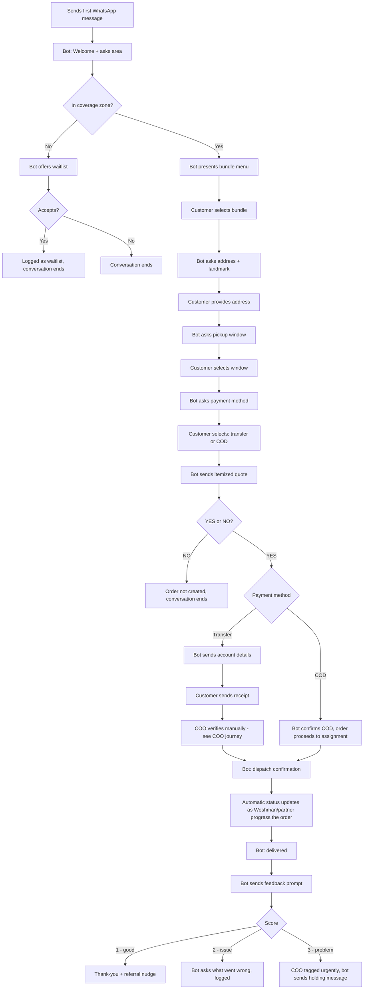
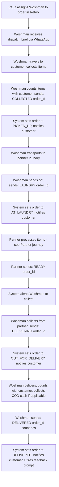
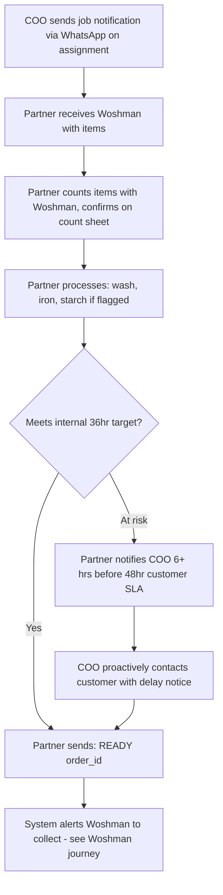
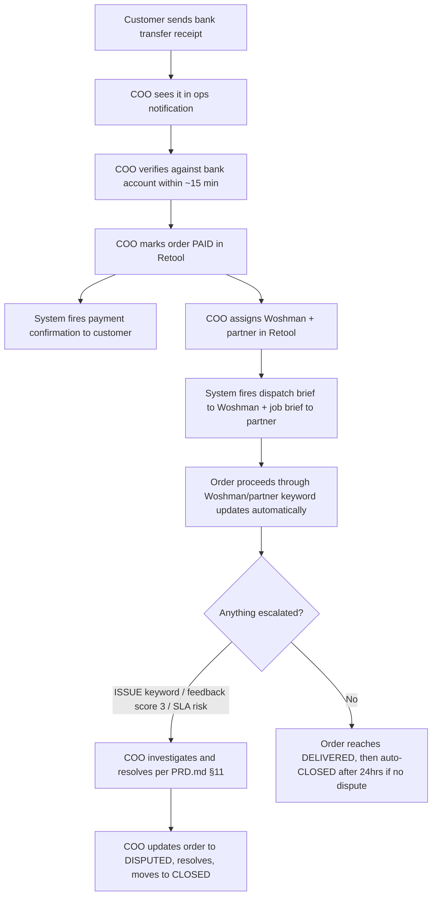
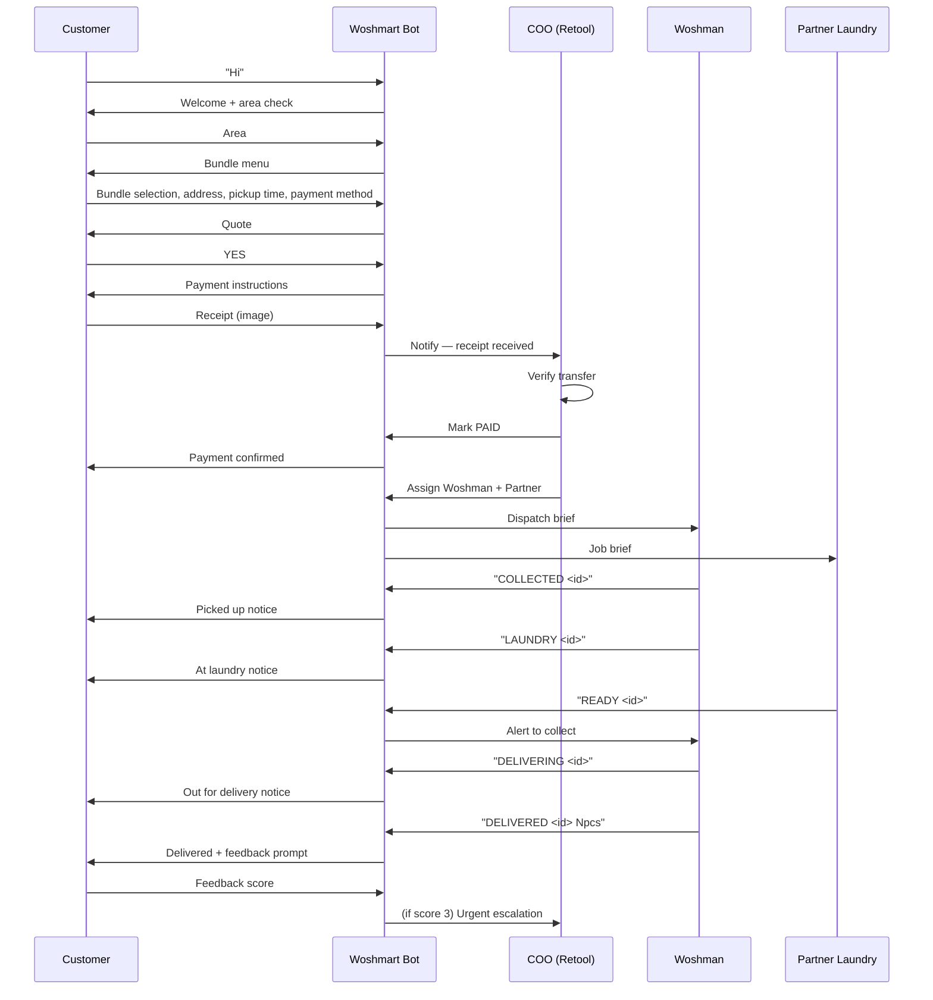

# Woshmart — User Journeys

Every actor's path through the system, end to end. Message copy referenced here is defined verbatim in `PRD.md` §10 — this document shows the *shape* of the journey, not a copy of the wording.

## 1. Customer journey (happy path)

### Customer — off-path branches

| Situation | What happens |
|---|---|
| No reply 30 min after quote sent | Order marked ABANDONED, timeout message sent, session resets |
| No payment receipt 45 min after YES (transfer) | One reminder sent |
| No payment receipt 60 min after YES (transfer) | Order marked ABANDONED, COO notified |
| Unmatched/unexpected reply mid-flow | Current prompt re-sent |
| 3 consecutive unmatched replies | Escalation message with MENU option, session flagged for COO visibility |
| Media sent when not expected | Polite "text only for now" + repeat of current prompt (exception: receipt image during AWAITING_PAYMENT is accepted) |
| Repeated door cancellations | Account progressively flagged — see `PRD.md` §11.6 — eventually requires prepayment or is blocked |

## 2. Woshman journey

### Woshman — off-path branches

| Situation | What happens |
|---|---|
| Item count mismatch at pickup or laundry handover | Woshman calls COO immediately — not a WhatsApp keyword, a real call. COO adjusts order, customer confirms revised total before proceeding. |
| Sends malformed or unrecognized keyword | System replies with a clear correction request, no silent failure |
| Sends keyword that implies an illegal status jump (e.g. DELIVERED before PICKED_UP) | Rejected with a clear explanation, order status unchanged |
| Cannot make scheduled pickup | Calls COO — COO reassigns or reschedules with the customer |
| Suspects missing/damaged item | Reports to COO **before leaving the laundry** — never after |
| Door cancellation | Confirms with COO — Woshman receives the ₦150 travel fee, customer account gets flagged per `PRD.md` §11.6 |

## 3. Partner laundry journey

### Partner — off-path branches

| Situation | What happens |
|---|---|
| Missing item discovered | Calls COO immediately — loss protocol activated (`PRD.md` §11.8) |
| Cannot do starch on a flagged order | Should have been excluded at onboarding — flagged partners aren't routed starch orders in the first place |
| Unreachable for an extended period | COO escalates to Founder, arranges transfer of items to a second partner |

## 4. COO / admin journey (Retool)

### COO — standing responsibilities (not event-triggered)

- Reviewing flagged/blocked account requests
- Editing Woshman/partner directory records
- Editing pricing config (`super_admin` only)
- Reviewing feedback log and marking items resolved
- Reviewing the audit log (`admin_actions`) periodically

## 5. Cross-actor sequence for one full order (reference)

